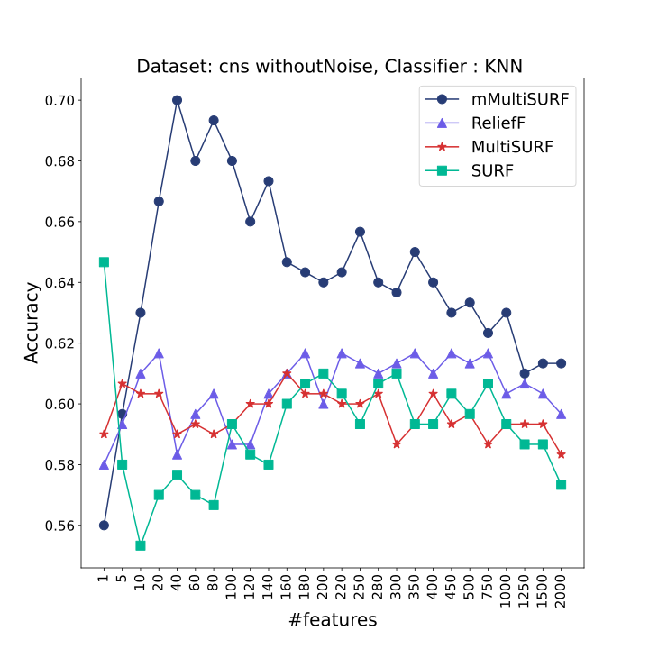
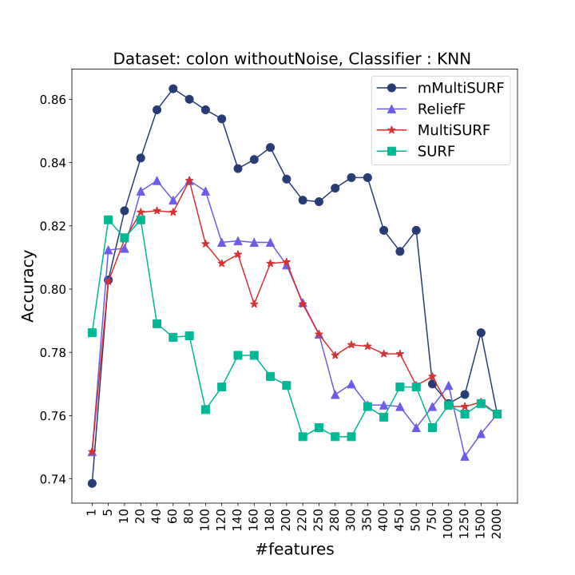
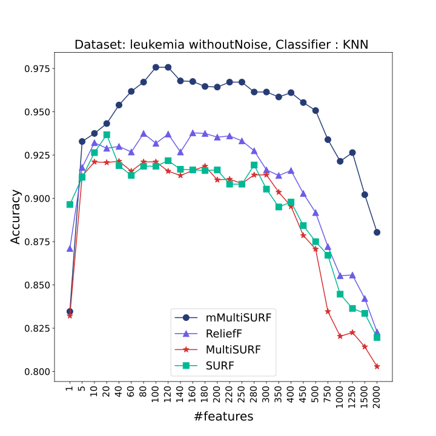
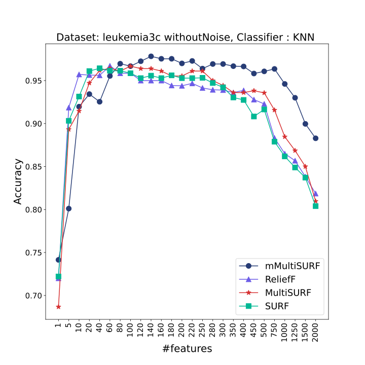
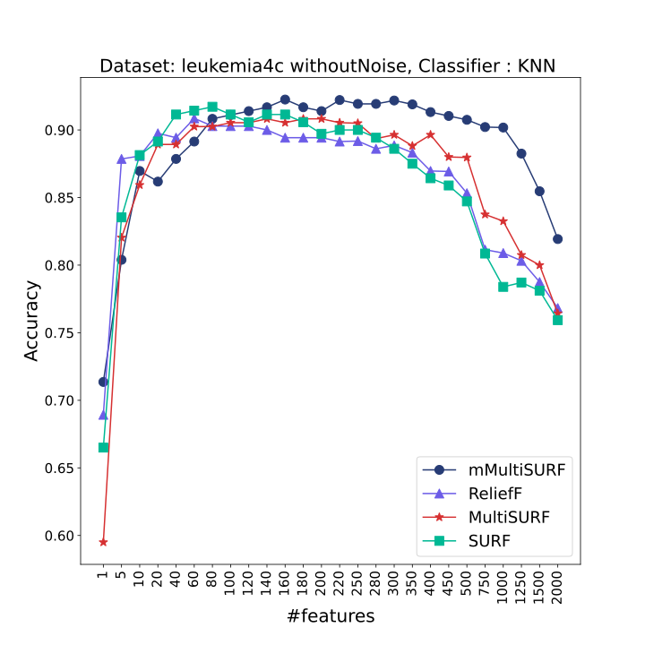
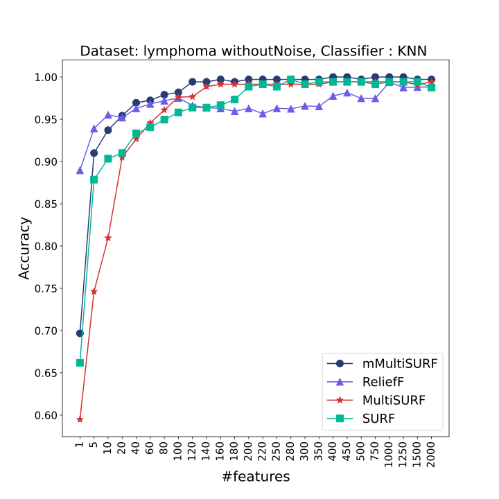
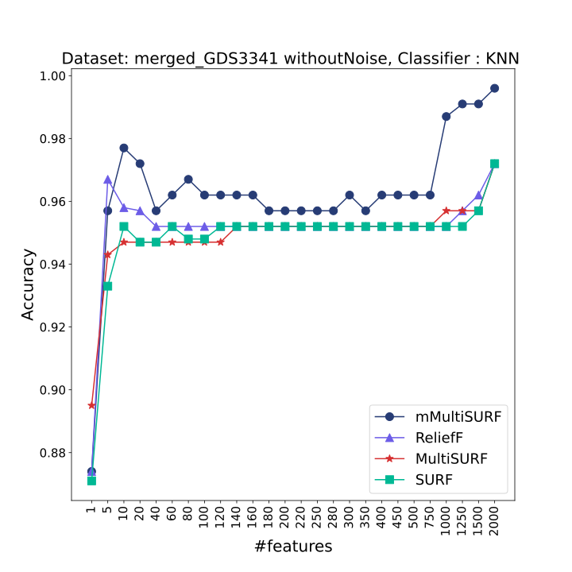
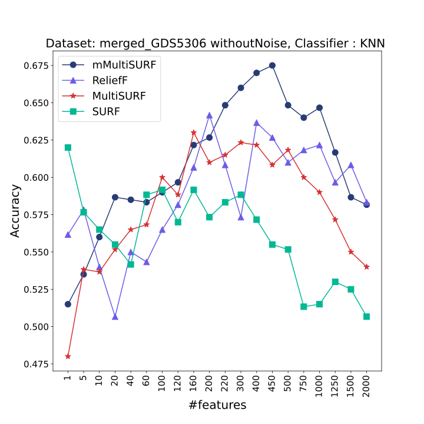

# mMultiSURF
mMultiSURF is a relief based feature selection method that proved to be effective in selecting relevant feature subsets more accurately in very high dimensional datasets.

<a href="https://drive.google.com/file/d/1HgQP5VUwIfxXWovUk6MMF8KsN7w39QPs/view"> `mMultiSURF- A relief based feature selection method considering class overlapping area among neighbouring instances and prior information` </a>

## Abstract

Feature selection is defined as a pre-processing technique for identifying a small subset of relevant features and eliminating irrelevant ones from high dimensional data. Among all the existing feature selection methods Relief based algorithms(RBAs) have gained popularity due to their simplicity, efficiency and ability to capture feature interactions. In our work, we proposed an improved version of recently proposed Relief based method, MultiSURF by resolving some drawbacks of existing RBAs. One major drawback of RBAs is that they don’t consider overlapping region in their weight calculation. To mitigate this drawback we incorporated a weight to each instance in the neighbourhood representing it’s probability of not being in overlapping region to limit its contribution to feature weights. Also we integrated prior class information in the margin objective to deal with imbalance data. In order to analyze the efficacy of our proposed algorithm mMUltiSURF, we performed large number of experiments on both UCI datasets and DNA microarray datasets. The experimental analysis showed that the aforementioned improvements help the algorithm to select relevant feature subsets more reliably in very high dimensional datasets.

## Highlights

<ul>
<li> mMultiSURF performs better than ReliefF, SURF and MultiSURF in presence of very high dimensional datasets. </li>
<li> It can classify imbalanced classes more accurately and holds
its performance even in presence of noisy data. </li>
<li> mMuiltiSURF is simple and easy to apply as no critical parameter needs to be tuned. </li>
</ul>

## Performance Comparison among several High Dimensional DNA Microarray Datasets

<!-- Row 1 with 3 images -->

  
  
  

<!-- Row 2 with 3 images -->

  
  
  

<!-- Row 3 with 2 images -->

  
  
  

